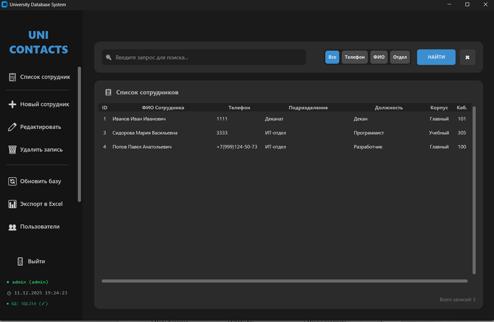
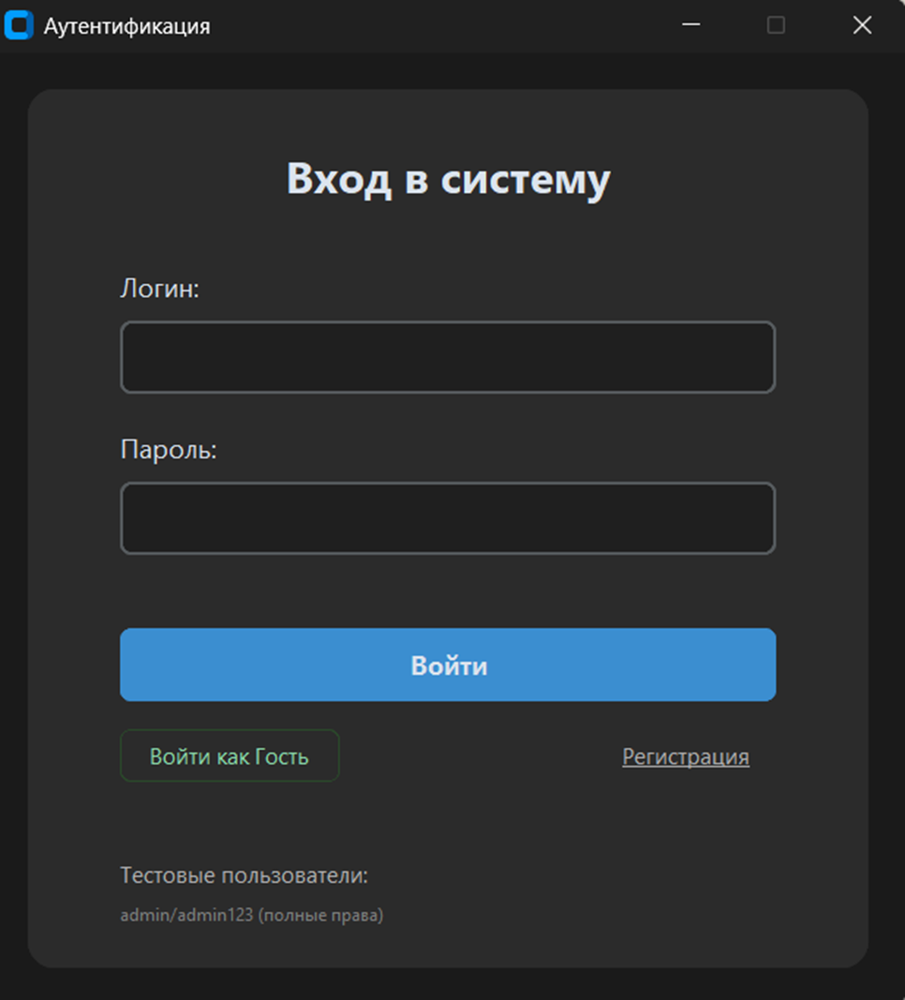

# 🎓 University Phone Book


**University Phone Book** — это защищенная Desktop-система для управления корпоративным справочником сотрудников университета. Приложение обеспечивает безопасное хранение персональных данных с использованием шифрования AES, удобный поиск, аналитику и экспорт ведомостей.

---

## 📸 Скриншоты
<div align="center">
  
  
</div>

## ✨ Ключевые возможности

* **🔐 Безопасность данных**:
    * Все чувствительные данные (ФИО, телефон, должность) хранятся в базе данных в зашифрованном виде (AES-256 via `cryptography`).
    * Пароли пользователей хешируются (SHA-256 + Salt).
    * Даже при утечке базы данных прочитать информацию без ключа шифрования невозможно.
* **💻 Современный UI**:
    * Интерфейс на базе **CustomTkinter** (Dark Mode).
    * Адаптивная верстка и удобные формы ввода.
* **☁️ Облачная база данных**:
    * Поддержка подключения к AWS TiDB / MySQL.
    * Оптимизированные SQL-запросы через `pymysql`.
* **📊 Экспорт и Аналитика**:
    * Генерация красиво оформленных Excel-ведомостей (`openpyxl`) с автоподбором ширины колонок.
    * Встроенная статистика по кампусам и отделам (интеграция `matplotlib`).
* **🚀 Deployment**:
    * Скрипт для сборки в единый `.exe` файл (Portable).

## 🛠 Технологический стек

* **Язык**: Python 3.10+
* **GUI**: CustomTkinter
* **Database**: TiDB Cloud (MySQL 8.0 compatible)
* **Security**: Cryptography (Fernet), Hashlib
* **Tools**: OpenPyXL (Excel), PyInstaller (Build), DotEnv (Config)

## 🚀 Установка и запуск

### Предварительные требования
* Python 3.10 или выше
* MySQL сервер (или облачный кластер TiDB)

### 1. Клонирование репозитория
```bash
git clone [https://github.com/your-username/university-phonebook.git](https://github.com/your-username/university-phonebook.git)
cd university-phonebook

2. Установка зависимостей

Рекомендуется использовать виртуальное окружение:
Bash

python -m venv venv
source venv/bin/activate  # Для Linux/macOS
venv\Scripts\activate     # Для Windows

pip install -r requirements.txt

3. Настройка окружения (.env)

Создайте файл .env в корне проекта и укажите параметры подключения. Внимание: Никогда не загружайте .env в публичный репозиторий!

Пример .env:
Ini, TOML

# Database Configuration
DB_HOST=gateway01.eu-central-1.prod.aws.tidbcloud.com
DB_PORT=4000
DB_NAME=university_db
DB_USER=root
DB_PASSWORD=your_secure_password
DB_SSL_CA=isrgrootx1.pem

# Security (Encryption Keys)
# Пароль и соль используются для генерации ключа шифрования данных
ENCRYPTION_PASSWORD=SuperSecretMasterKey123!
ENCRYPTION_SALT=RandomSaltString

4. Запуск
Bash

python main.py